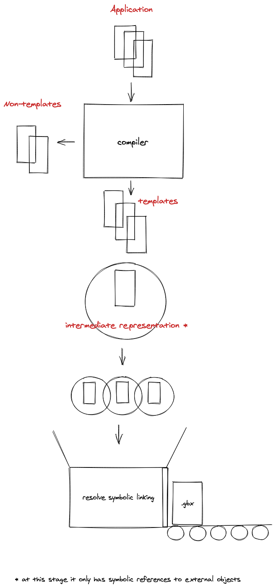

# glimmer-vm

⚠️ Not complete yet.

## The Compiler

*Repository*: [https://github.com/glimmerjs/glimmer-vm](glimmerjs/glimmer-vm)

The compiler turns your application's templates into Glimmer binary bytecode.

First, it will traverse the application and discover templates.

Then it will create an intermediate representation (IR). This means that it currently has a vague connection to other templates, helpers, etc. It has not discovered them yet but there is an expectation that they will be there.

Once all the templates has an IR, the compiler will link the vague connectio so they are not so vague anymore.

At last, the compiler will save a `.gbx` file to disk. This file is the binary executeable which can be served to a browser and evaluated at runtime.

### Evaluating bytecode in the browser
